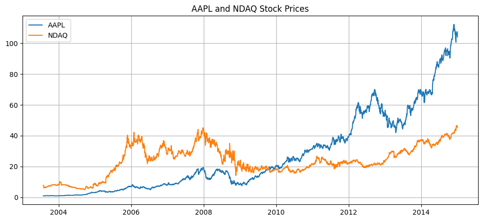
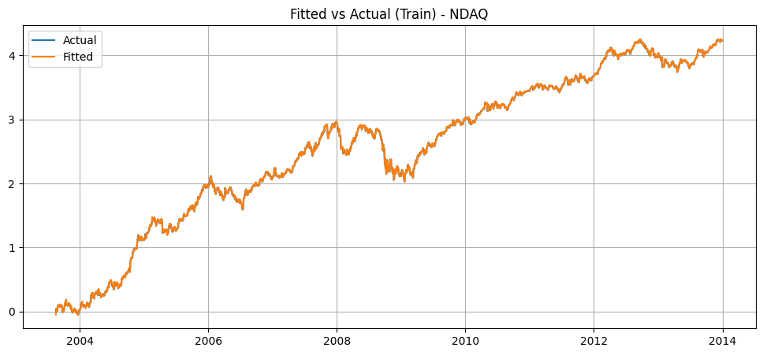
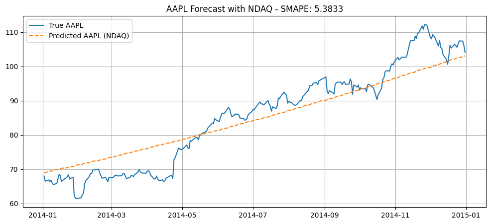

# STATS202HW3
*Duke Kunshan University STATS 202 HW2*

# 📈 AAPL Stock Forecasting using SARIMA with NDAQ as Exogenous Regressor

## Introduction

This project builds a time series forecasting model to predict AAPL stock prices using a SARIMA model. To improve forecast performance, the model incorporates NDAQ (the Nasdaq index) as an exogenous variable. The goal is to leverage both company-specific and market-level information to better capture the dynamics of AAPL's stock price movement.

---

## Data

The dataset contains daily stock prices for AAPL and NDAQ from 2003 to 2014. It was loaded from a CSV file hosted online. Missing values were handled using forward-fill. Both time series were visualized to observe general trends:

- AAPL shows strong upward growth, especially after 2009.
- NDAQ follows a more cyclical, market-wide pattern.

Log-transformation was applied to both series to stabilize variance. The data was then split into a training set (before 2014) and a test set (2014 onward). The NDAQ series, intended as an external input to the model, was standardized using `StandardScaler`.

---

## Method

The modeling pipeline follows these main steps:

1. **Feature engineering**:  
   NDAQ was selected as an exogenous regressor to reflect market trends that could influence AAPL. The log-transformed and standardized NDAQ series was used as external input. Log-transformation was also applied to AAPL.

2. **Model selection**:  
   The `auto_arima` function from `pmdarima` was used to search for the best SARIMA configuration using AIC as the criterion. The selected model was: ARIMA(2,1,2)(0,0,0)[12] with intercept.
   
3. **Model training**:  
The chosen SARIMA model was trained on the log-transformed AAPL series with the standardized NDAQ as the exogenous variable.

4. **Forecasting**:  
Forecasts were made on the test period (2014) and exponentiated to return to price scale. Both in-sample fitted values and out-of-sample predictions were evaluated using SMAPE.

---

## Result

**Model diagnostics**:

- All AR and MA terms were statistically significant.
- The residuals showed no significant autocorrelation.
- Residuals were not normally distributed and exhibited volatility clustering (common in financial series).

**Performance**:

  

  <em>Figure 1: AAPL and NDAQ Stock Price.</em>

The plot compares the historical stock prices of AAPL and NDAQ from 2003 to 2014. AAPL shows a strong upward trend, especially after 2009, reflecting rapid company growth. NDAQ rises more modestly and exhibits cyclical patterns, particularly around the 2008 financial crisis. This contrast highlights AAPL's individual performance compared to the broader market represented by NDAQ. The visualization justifies using NDAQ as an exogenous input, capturing market-level signals that may influence AAPL. Overall, the plot offers a clear visual overview of both series’ long-term trends.

  

  <em>Figure 2: Fitted VS Actual (Train).</em>

- **Training SMAPE**: 3.384  
The model fit closely tracked the training data and captured the major trends in AAPL’s log returns.

  

  <em>Figure 3: AAPL Forcast with NDAQ.</em>

- **Test SMAPE**: 5.3833  
The forecast followed the general trend but underestimated some sharp increases. Overall, it showed good generalization with modest error.

**Conclusion**:  
Incorporating NDAQ as an exogenous variable improved the model's ability to account for market-wide signals. The SARIMA model with external input provides a practical framework for forecasting stock prices when both company-level and macro-level influences are relevant.

## Future Work

There are several directions to improve or extend this project:

- **Residual modeling**:  
Since the residuals display heteroskedasticity and non-normality, a possible extension is to model volatility using GARCH or similar frameworks on top of SARIMA.

- **More exogenous variables**:  
Additional market indicators such as interest rates, S&P 500 index, or macroeconomic data could be included to provide broader context and enhance the model.

- **High-frequency data**:  
Applying the model to intraday or hourly data may reveal short-term dependencies not captured in daily prices.

- **Model comparison**:  
Comparing SARIMA with machine learning models (e.g., Random Forest, LSTM) could help assess whether more flexible models outperform traditional time series approaches on this task.

- **Rolling forecasts**:  
A rolling window evaluation strategy could better reflect real-world forecasting performance and allow dynamic model updating.

